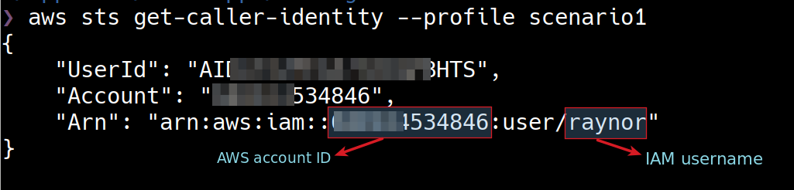
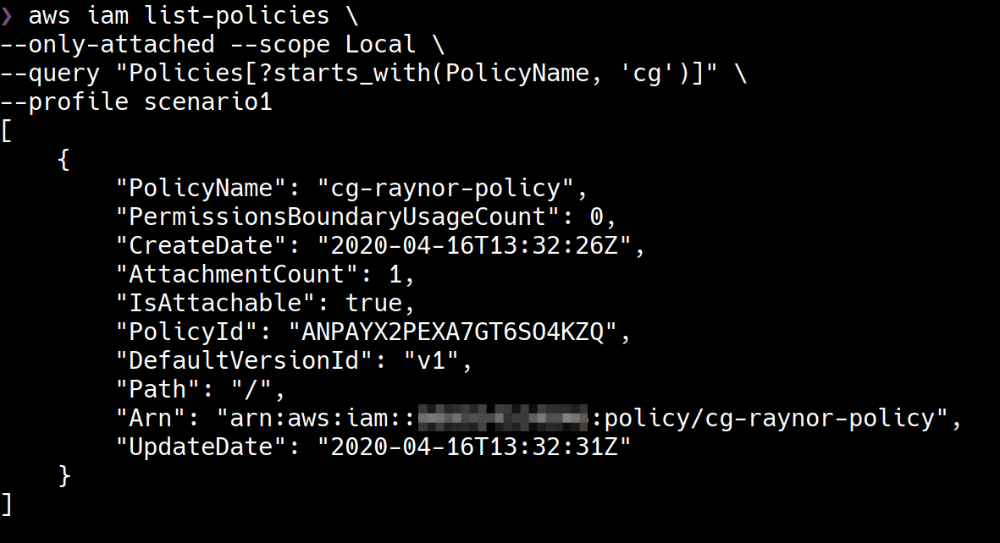
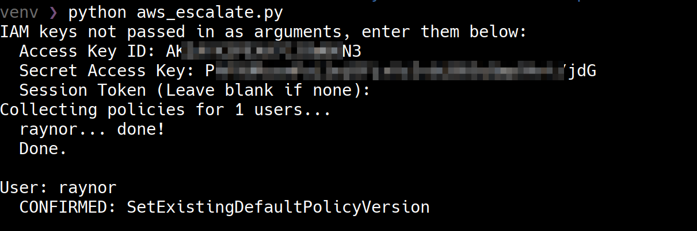

# Scenario 1 - IAM Privilege Escalation By Rollback

iam_privesc_by_rollback

## What is the scenario

The scenario begins with IAM User "Raynor" security credentials.

The objective is to acquire full admin privileges in the AWS account.

More scenario details - https://github.com/RhinoSecurityLabs/cloudgoat/blob/master/scenarios/iam_privesc_by_rollback/README.md

## Setting up the scenario

        python3 cloudgoat.py create iam_privesc_by_rollback

## Walkthrough

### Exploitation Route

### Step by step instructions

In this scenario, we have a set of AWS Security Credentials to being with.

If you have a set of AWS credentials and you want to perform enumeration then an ideal first step would be to create a named profile with the security credentials using AWS CLI.

        aws configure --profile scenario1

One of the first things to do before starting enumeration is to identity/verify who the security credentials belong to - 

        aws sts get-caller-identity --profile scenario1

There are various tools to enumerate the permissions of the security credentials across services in the AWS account. [Scout Suite](https://github.com/nccgroup/ScoutSuite), [enumerate-iam](https://github.com/andresriancho/enumerate-iam) etc. are few of them. These tools brute force AWS API calls to determine which API calls are allowed for a given set of security credentials.

These tools are good at identifying permissions across the AWS account at a high-level but they are not built to identify certain classes of vulnerabilities such as privilege escalation via IAM policies by abusing permissions.

When evaulating security of an IAM identity (users, groups of users, or roles), enumerating policies and permissions is an essential step. In this case, let's enumerate Inline Policies and Managed Policies of  IAM user "Raynor" using the following commands respectively - 

        aws iam list-user-policies --user-name raynor --profile scenario1
        aws iam list-attached-user-policies --user-name raynor --profile scenario1

A "[Customer Managed Policy](https://docs.aws.amazon.com/acm/latest/userguide/authen-custmanagedpolicies.html)" `cg-raynor-policy` is attached directly to the IAM user "Raynor".

Let's enumerate this customer managed policy `cg-raynor-policy` further. We will use IAM `list-policies` with `--only-attached` to extract only attached policies and "scope" as `Local` to only extract customer managed policies. We are using `--query` to extract only information related to `cg-raynor-policy`. 

> When retrieving information using AWS CLI. "query" option can be used to perform advanced querying. "query" uses JMESPath specification to parse JSON output. If you are going to be doing AWS security audits or pentesting it is recommended to investment some time in learning to parse JSON with JMESPath https://docs.aws.amazon.com/cli/latest/userguide/cli-usage-output.html

        aws iam list-policies \
        --only-attached --scope Local \
        --query "Policies[?starts_with(PolicyName, 'cg')]" \
        --profile scenario1

 

We now have more information about the customer managed policy `cg-raynor-policy`. Notice that the default version is `v1`.

> When you make changes to an IAM customer managed policy, and when AWS makes changes to an AWS managed policy, the changed policy doesn't overwrite the existing policy. Instead, IAM creates a new version of the managed policy. IAM stores up to five versions of your customer managed policies.

We now have enough details about the policy to start enumerating the permissions that the policy is entitled to. We'll use `get-policy-version` to retrieve the policy document which is a JSON document that lists the policy permissions.

        aws iam get-policy-version \
        --policy-arn "<POLICY-ARN>"  \
        --version-id "v1" --profile scenario1

The policy document shows that an IAM identity with the policy (IAM user "Raynor" in this case) is allowed to perform any IAM "Get" or "List" operations against any resource. The policy also shows that one "Set" operation, `iam:SetDefaultPolicyVersion`, is allowed against any resource. This set of permissions look normal and might not be flagged by many security scanners but the fact that `iam:SetDefaultPolicyVersion` is allowed can lead to serious security issues. 

> An IAM identity with the `iam:SetDefaultPolicyVersion` permission may be able to escalate privileges through existing policy versions that are not currently in use. If a policy that they have access to has versions that are not the default, they would be able to change the default version to any other existing version.

To check if `iam:SetDefaultPolicyVersion` leads to any security issues, we need to check if there are other versions of the customer managed policy `cg-raynor-policy`. As we already mentioned, there can be upto 5 versions of the policy.

There are 5 different policy versions for `cg-raynor-policy`. Now that the "Raynor" user has `iam:SetDefaultPolicyVersion` permission with default version v1, the user can roll-back to any version. If any of these versions have additional permissions then it is a privilege escalation and the severity depends on the additional permissions.

Let's enumerate each policy version and check if we can gain access to additional permissions.

        aws iam get-policy-version \
        --policy-arn "arn:aws:iam::ACCOUNT-ID:policy/cg-raynor-policy"  \
        --version-id "v5" --profile scenario1

The version 5 of the policy introduces a severe vulnerability. The permissions of v5 effectively grants the user Adminstrative access to the AWS account.

Let's make v5 the default version which means from a restricted IAM user, we are escalating to become a user with Adminstrator access.

        aws iam set-default-policy-version \
        --policy-arn "arn:aws:iam::ACCOUNT-ID:policy/cg-raynor-policy" \
        --version-id v5 --profile scenario1

We'll use [enumerate-iam](https://github.com/andresriancho/enumerate-iam) script to quickly verify the additional permissions. 

        python enumerate-iam.py --access-key <ACCESS-ID> --secret-key <SECRET-KEY>

Notice that we have achieved administrator access in the AWS account.

## Tools that detect this vulnerability

Traditional AWS security scanners and audit tools might not report the `iam:SetDefaultPolicyVersion` permission as a security issue.

[aws_escalate.py](https://github.com/RhinoSecurityLabs/Security-Research/blob/master/tools/aws-pentest-tools/aws_escalate.py) is a script that enumerates all the policies of an IAM identity for permissions that can potentially lead to privilege escalation. 

## Destroy the scenario resources

        python3 cloudgoat.py destroy iam_privesc_by_rollback

## References

- [IAM Identifiers](https://docs.aws.amazon.com/IAM/latest/UserGuide/reference_identifiers.html)
- [Policies and Permissions](https://docs.aws.amazon.com/IAM/latest/UserGuide/access_policies.html)
- [Managed Policies and Inline Policies](https://docs.aws.amazon.com/IAM/latest/UserGuide/access_policies_managed-vs-inline.html)
- [Controlling Command Output from the AWS CLI](https://docs.aws.amazon.com/cli/latest/userguide/cli-usage-output.html)
- [IAM JSON Policy Elements Reference](https://docs.aws.amazon.com/IAM/latest/UserGuide/reference_policies_elements.html)
- [Versioning IAM Policies](https://docs.aws.amazon.com/IAM/latest/UserGuide/access_policies_managed-versioning.html)
- [SetDefaultPolicyVersion](https://docs.aws.amazon.com/IAM/latest/APIReference/API_SetDefaultPolicyVersion.html)
- [AWS IAM Privilege Escalation Methods](https://github.com/RhinoSecurityLabs/AWS-IAM-Privilege-Escalation)
